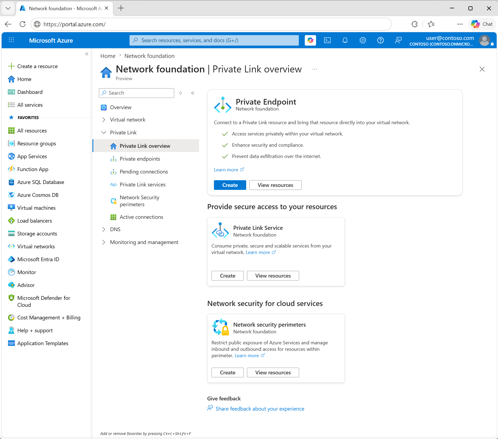

# What is Azure Private Link? 

* Azure Private Link
  * 👀enables you 
    * -- to access, via Virtual Network's [private endpoint](private-endpoint-overview.md), 
      * to -- 👀 
        * Azure PaaS Services (_Example:_ Azure Storage and SQL Database) &
        * Azure hosted customer-owned/partner services
      * == 
        * ❌service NOT exposed | public internet ❌
        * virtual network communicates -- via Microsoft backbone network, with -- service  
  * Service
    * [how to create your own](private-link-service-overview.md)
    * == service BEHIND standard load balancer 
  * 

> Different Azure PaaS will onboard to Azure Private Link at different schedules. 
> See [Private Link availability](availability.md) for an accurate status of Azure PaaS on Private Link.
 > For known limitations, see [Private Endpoint](private-endpoint-overview.md#limitations) and [Private Link Service](private-link-service-overview.md#limitations). 

## Key benefits

Azure Private Link provides the following benefits:  

- **Privately access services on the Azure platform**: Connect your virtual network using private endpoints to all services that can be used as application components in Azure. Service providers can render their services in their own virtual network and consumers can access those services in their local virtual network. The Private Link platform will handle the connectivity between the consumer and services over the Azure backbone network. 
 
- **On-premises and peered networks**: Access services running in Azure from on-premises over ExpressRoute private peering, VPN tunnels, and peered virtual networks using private endpoints. There's no need to configure ExpressRoute Microsoft peering or traverse the internet to reach the service. Private Link provides a secure way to migrate workloads to Azure.
 
- **Protection against data leakage**: A private endpoint is mapped to an instance of a PaaS resource instead of the entire service. Consumers can only connect to the specific resource. Access to any other resource in the service is blocked. This mechanism provides protection against data leakage risks. 
 
- **Global reach**: Connect privately to services running in other regions. The consumer's virtual network could be in region A and it can connect to services behind Private Link in region B.  
 
- **Extend to your own services**: Enable the same experience and functionality to render your service privately to consumers in Azure. By placing your service behind a standard Azure Load Balancer, you can enable it for Private Link. The consumer can then connect directly to your service using a private endpoint in their own virtual network. You can manage the connection requests using an approval call flow. Azure Private Link works for consumers and services belonging to different Microsoft Entra tenants. 

> [!NOTE]
> Azure Private Link, along with Azure Virtual Network, span across [Azure Availability Zones](../availability-zones/az-overview.md) and are therefore zone resilient. To provide high availability for the Azure resource using a private endpoint, ensure that resource is zone resilient.

## Availability 

For information on Azure services that support Private Link, see [Azure Private Link availability](availability.md).

For the most up-to-date notifications, check the [Azure Private Link updates page](https://azure.microsoft.com/updates/?product=private-link).

## Logging and monitoring

Azure Private Link has integration with Azure Monitor. This combination allows:

 - Archival of logs to a storage account.

 - Streaming of events to your Event Hubs.

 - Azure Monitor logging.

You can access the following information on Azure Monitor: 

- **Private endpoint**: 

    - Data processed by the Private Endpoint  (IN/OUT)
 
- **Private Link service**:

    - Data processed by the Private Link service (IN/OUT)

    - NAT port availability  
 
## Pricing   
For pricing details, see [Azure Private Link pricing](https://azure.microsoft.com/pricing/details/private-link/).
 
## FAQs  
For FAQs, see [Azure Private Link FAQs](private-link-faq.yml).
 
## Limits  
For limits, see [Azure Private Link limits](../azure-resource-manager/management/azure-subscription-service-limits.md#private-link-limits).

## Service Level Agreement
For SLA, see [SLA for Azure Private Link](https://azure.microsoft.com/support/legal/sla/private-link/v1_0/).

## Next steps

- [Quickstart: Create a Private Endpoint using Azure portal](create-private-endpoint-portal.md)

- [Quickstart: Create a Private Link service by using the Azure portal](create-private-link-service-portal.md)

- [Learn module: Introduction to Azure Private Link](/training/modules/introduction-azure-private-link/)
